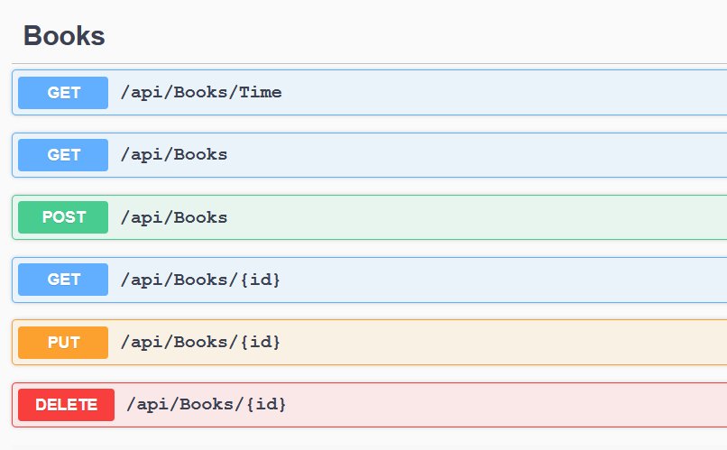
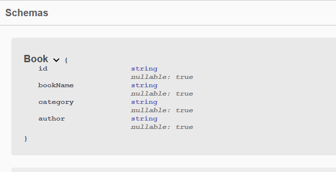

# NET5_API
API containerised and deployed to an AWS EC2 instance. The API is connected to a cloud hosted Mongo database using MongoDB Atlas.

## **Docker images**
- linux/arm:     mahoney0101/raspberrypiapi:0.0.0.1
- linux/amd64:  mahoney0101/testapi:0.0.0.1 

# Swagger Docs

